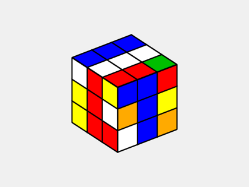

 
 

<h1 align="center"> Rubik's Cube Solver </h1>

  

<!-- TABLE OF CONTENTS -->
<h2 id="table-of-contents"> :book: Table of Contents</h2>

  
Table of Contents

  <ol>
    <li><a href="#about-the-project"> ➤ About The Project</a></li>
    <li><a href="#overview"> ➤ Overview</a></li>
    <li><a href="#step1"> ➤ Step 1: Solving The White Cross </a></li>
    <li><a href="#step2"> ➤ Step 2: Solving The First Layer </a></li>
    <li><a href="#step3"> ➤ Step 3: Solving The Second Layer </a></li>
    <li><a href="#step4"> ➤ Step 4: Solving The Yellow Cross </a></li>
    <li><a href="#step5"> ➤ Step 5: Solving The Yellow Face </a></li>
    <li><a href="#step6"> ➤ Step 6: Solving The Third Layer Corners </a></li>
    <li><a href="#step7"> ➤ Step 7: Solving The Third Layer Edges </a></li>
    <li><a href="#credits"> ➤ Credits</a></li>
  </ol>

  

<!-- ABOUT THE PROJECT -->
<h2 id="about-the-project"> :pencil: About The Project</h2>

 
  If you're new to Rubik's Cube solving, let's dive into it. The Rubik's Cube Solver is a tool designed to crack the challenge posed by the iconic Rubik's Cube. This six-sided puzzle features individual colored squares on each face, and the objective is to rearrange these colors until each face exhibits a uniform hue.

  

<!-- OVERVIEW -->
<h2 id="overview"> :cloud: Overview</h2>

 
  The solver strategically manipulates the cube through a series of rotations, solving one layer at a time. Think of it as deciphering a complex code, where each twist and turn is a step toward the ultimate goal, achieving a perfectly solved Rubik's Cube.

  Completing the Rubik's Cube is a triumph of logic and problem-solving. The solver engages in a dance of twists and rotations, overcoming challenges until all colors align harmoniously on each face. It's a satisfying journey that culminates in the visual delight of a perfectly solved Rubik's Cube.

  

<!-- STEP1 -->
<h2 id="step1"> :small_orange_diamond: Step 1: Solving The White Cross</h2>

The solveWhiteCross method is responsible for solving the white cross on the Rubik's Cube. It employs a step-by-step approach, considering the orientation and placement of white edge pieces in different positions on the cube faces. The function uses various algorithms to manipulate the cube and achieve the desired white cross configuration.

<h3>🧠Algorithm Explanation</h3>

The function first initializes variables to track the state of each edge piece and the overall progress of the white cross. It then checks each edge piece on the bottom face (denoted as 'w') against the adjacent face's center color (e.g., front, left, right, back). If an edge piece is correctly positioned, it increments the count of correct white edge pieces.

If an edge piece is not in the correct position, the function executes specific cube rotations (e.g., F, B, R, L) to align the pieces correctly. The process continues until all white edge pieces are correctly positioned.

The function also considers edge pieces on the second layer and performs appropriate rotations to solve those as well.

After successfully solving the white cross, the function prints a success message.

  

  

<!-- STEP2 -->
<h2 id="step2"> :small_orange_diamond: Step 2: Solving The First Layer</h2>

The solveFirstLayer method in the Rubik's Cube solver is responsible for solving the first layer of the cube, which involves correctly placing and orienting the white corner pieces. The method utilizes a step-by-step approach, considering the current state of each corner piece and performing specific algorithms to achieve the desired configuration.

The Pacman will quickly find a solution via running the following commands:

<h3>🧠Algorithm Explanation</h3>

The function starts by checking the initial state of each white corner piece, tracking the progress of the first layer solution. It identifies the corners in the top-left, top-right, bottom-left, and bottom-right positions, determining whether they are correctly placed and oriented.

If a corner is not in the correct position, the function executes a series of cube rotations (e.g., R, L, U, D) along with their inverses to adjust the corner pieces. The process continues until all white corner pieces are correctly placed and oriented.

The algorithm accounts for various scenarios, including different positions of white corners in the first layer. It utilizes specific sequences of cube rotations to achieve the desired configuration for each corner.

If there are white pieces in the third layer, the function adjusts their positions by turning the U face or U' face and checking for correct placements. If needed, it backtracks by turning U or U' again until the correct configuration is achieved.

After successfully solving the first layer, the function prints a success message.

  

  

<!-- STEP3 -->
<h2 id="step3"> :small_orange_diamond: Step 3: Solving The Second Layer</h2>

The solveSecondLayer method in the Rubik's Cube solver focuses on solving the second layer of the cube. This involves correctly placing and orienting the edge pieces with two colors (not including white) to complete the first two layers of the cube.

The function uses a step-by-step approach, checking the initial state of each edge piece in the second layer and tracking the progress of the solution. It employs specific algorithms to adjust the positions of the edge pieces until the entire second layer is solved.

<h3>🧠Algorithm Explanation</h3>

The function begins by checking each edge piece in the second layer and counting the number of correctly positioned pieces. If an edge piece is already in the correct position, it increments the count of correct pieces.

If an edge piece is not in the correct position, the function executes specific cube rotations based on the relative positions of the edge piece and the white stickers in the first layer. It considers different scenarios for each side of the cube (front, back, left, right) and makes appropriate adjustments.

The function also handles cases where there is a "correct piece in the wrong position." In such situations, it performs necessary cube rotations to bring the edge piece to the correct position.

If any adjustments are made, the function increments the count of correct pieces and continues the process until all edge pieces in the second layer are correctly positioned.

After successfully solving the second layer, the function prints a success message.

  

  

<!-- STEP4 -->
<h2 id="step4"> :small_orange_diamond: Step 4: Solving The Yellow Cross</h2>

The solveYellowCross method in the Rubik's Cube solver is designed to solve the yellow cross on the cube. It employs specific algorithms and moves to manipulate the cube's state and achieve the desired yellow cross configuration on the top face.

<h3>🧠Algorithm Explanation</h3>

The function checks the current state of yellow stickers on the top face and executes various algorithms based on their arrangement. The goal is to create a yellow cross, handling scenarios with two, three, or four yellow stickers in specific positions.

If the yellow cross is already solved, the function exits with a success message. Otherwise, it performs moves like <code>F U R U' R' F'</code> to ensure at least two yellow stickers are on top. It then adapts its approach based on the specific arrangement of yellow stickers.

If successful, the function prints a success message.

  

  

<!-- STEP5 -->
<h2 id="step5"> :small_orange_diamond: Step 5: Solving The Yellow Face</h2>

The solveYellowCross method in the Rubik's Cube solver is designed to solve the yellow cross on the cube. It employs specific algorithms and moves to manipulate the cube's state and achieve the desired yellow cross configuration on the top face.

<h3>🧠Algorithm Explanation</h3>

The function first counts the number of yellow stickers on the top face. If all four corners are yellow, indicating the yellow face is already solved, the function exits with a success message.

If there are two yellow stickers, it positions them correctly using the algorithm <code>R U R' U R U U R'</code>. This algorithm is repeated until all four corners have yellow stickers.

The function adapts its approach based on the current arrangement of yellow stickers, ensuring that the yellow face is fully solved. It prints the corresponding moves for positioning the yellow stickers correctly.

If successful, the function prints a success message.

  

  

<!-- STEP6 -->
<h2 id="step6"> :small_orange_diamond: Step 6: Solving The Third Layer Corners</h2>

The solveThirdLayerCorners method focuses on solving the corner pieces of the third layer on the Rubik's Cube. It utilizes specific algorithms and moves to manipulate the cube and achieve the desired configuration of the third layer corners.

<h3>🧠Algorithm Explanation</h3>

The function first checks the number of correctly positioned third layer corner pieces. If all four corners are in the correct position, the function exits with a success message.

If there are already two correctly positioned corner pieces, the function applies specific algorithms to solve the remaining corners. It checks adjacent faces for pairs of correctly positioned corner pieces and applies reverse moves accordingly.

If there are no correctly positioned corners, the function performs a series of <code>U</code> and <code>U'</code> turns to reposition the cube and rechecks for correctly positioned corners. This process is repeated until at least two corner pieces are in the correct position.

The function then adapts its approach based on the specific arrangement of correctly positioned corner pieces, ensuring the entire third layer corners are solved. It prints the corresponding moves for solving the corners.

If successful, the function prints a success message.

  

  

<!-- STEP7 -->
<h2 id="step7"> :small_orange_diamond: Step 7: Solving The Third Layer Edges</h2>

The <code>solveThirdLayerEdges</code> method is designed to solve the edge pieces of the third layer on the Rubik's Cube. It checks the current state of the cube and performs specific algorithms to correctly position the third layer edges.

<h3>🧠Algorithm Explanation</h3>

The method begins by checking if the cube is already solved. If all edge pieces are in their correct positions, the method prints a success message and returns.

If not solved, the method counts the number of correctly positioned edge pieces. If there are less than four correct edges, the method enters a loop to perform the necessary algorithms until all edges are correctly positioned.

The method then evaluates each edge piece individually, determining the appropriate algorithm based on its current position and orientation relative to the adjacent faces. It prints the corresponding algorithm and executes the required moves to solve the edges.

After each iteration, the method rechecks the number of correctly positioned edges. The loop continues until all four edges are in their correct positions.

  

 

  

<!-- CREDITS -->
<h2 id="credits"> :scroll: Credits</h2>

Hakan Gezginci

Acknowledgements: Based on offical Rubik's Cube Solution, <a href="https://rubiks.com/en-US/solve-it/">https://rubiks.com/en-US/solve-it/</a>
